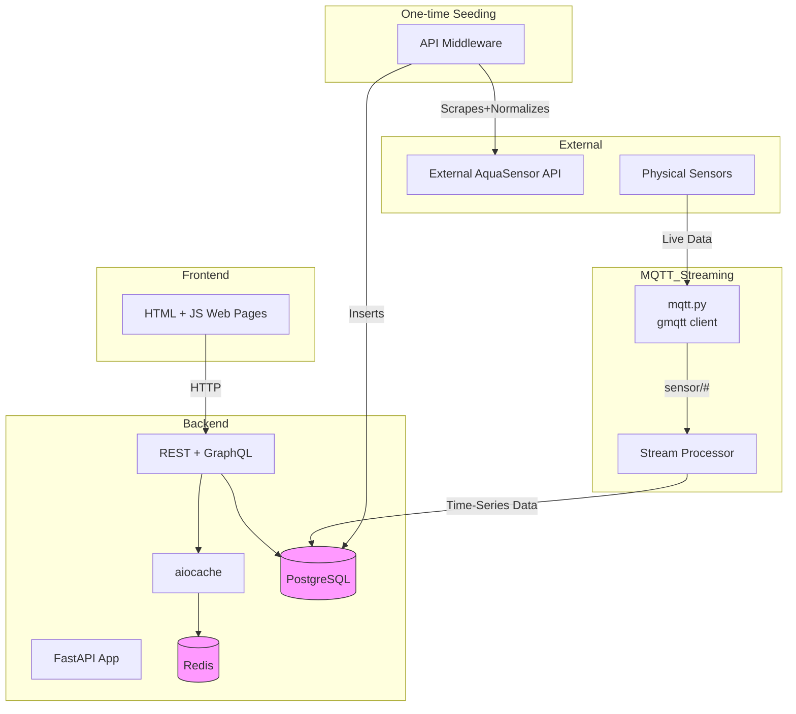

```mermaid
graph TD
  subgraph Frontend
    FE[HTML + JS Web Pages]
  end

  subgraph Backend
    BE[FastAPI App]
    API[REST + GraphQL]
    Cache[aiocache]
    DB[(PostgreSQL)]
    Redis[(Redis)]
  end

  subgraph MQTT_Streaming
    MQTTClient[mqtt.py<br/>gmqtt client]
    StreamProcessor[Stream Processor]
  end

  subgraph External
    AquaSensorAPI[External AquaSensor API]
    Sensors[Physical Sensors]
  end

  FE -->|HTTP| API
  API --> DB
  API --> Cache
  Cache --> Redis

  MQTTClient -->|sensor/#| StreamProcessor
  Sensors -->|Live Data| MQTTClient
  StreamProcessor -->|Time-Series Data| DB

  subgraph DevTools[One-time Seeding]
    Seeder[API Middleware]
    Seeder -->|Scrapes+Normalizes| AquaSensorAPI
    Seeder -->|Inserts| DB
  end

  classDef storage fill:#f9f,stroke:#333,stroke-width:1px;
  class Redis,DB storage;
```
