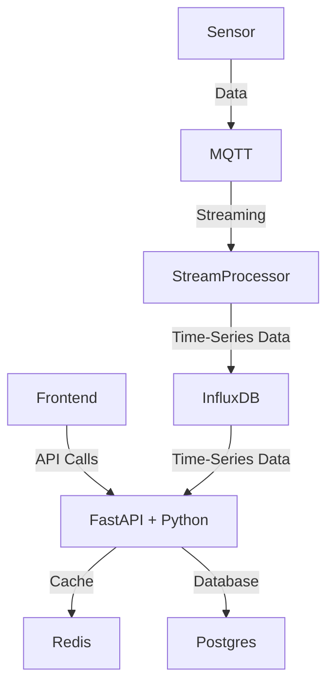

```mermaid
graph TD;
    Frontend -->|API Calls| Backend[FastAPI + Python];
    Backend -->|Cache| Redis;
    Backend -->|Database| Postgres;
    InfluxDB -->|Time-Series Data| Backend;
    
    Sensor -->|Data| MQTT;
    MQTT -->|Streaming| StreamProcessor;
    StreamProcessor -->|Time-Series Data| InfluxDB;

```